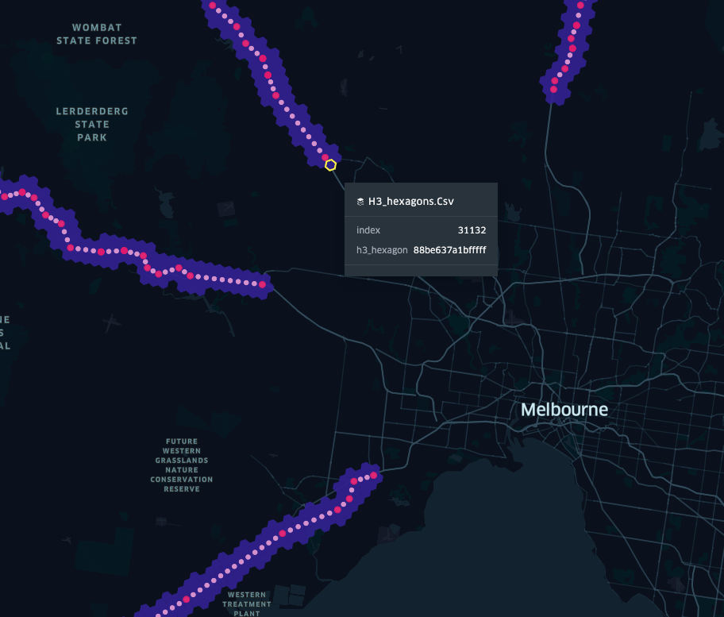

# H3 Australian National Highways

This repo contains code and data to generate a H3 representation of the Australian National Highways.




## Run the code

```bash
virtualenv -p python3 venv
source venv/bin/activate
pip install -r requirements.txt
python main.py

```


## Link
- [h3-py: Uber’s H3 Hexagonal Hierarchical Geospatial Indexing System in Python](https://uber.github.io/h3-py/intro.html)

